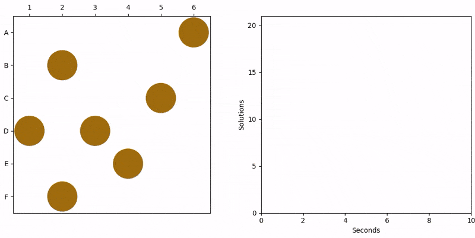

# GeniusSquareSolver
Finds solutions to the board game _The Genius Square_.

## What is The Genius Square?
The Genius Square is a fun puzzle game, which you should buy if you haven't already! 

You can read more about it at [Board Game Geek](https://boardgamegeek.com/boardgame/273065/genius-square).

## How is it played?
Seven dice are rolled, each face corresponding to a location on the board. A 'blocker' piece is placed at each location. The player then has to fill the remaining spaces on the board with the coloured play pieces! Players can play solo or take on an opponent head-to-head.

## What is the purpose of this project?
This is a small project to teach myself Python. The program will roll the dice, place blockers on the board, and then attempt to find possible solutions using a recursive algorithm. The solved board is displayed with Matplotlib, together with a line plot of the number of solutions found vs time taken.

## How do I use this project?
This is a barebones Python script because I haven't learnt anything about packaging! You'll need Python, along with Numpy and Matplotlib.
You might like to change the SOLUTION_LIMIT constant which limits the number of solutions found.

**Disclaimer:**
_"The Genius Square" is probably a registered trademark, or protected by copyright, or some sort of protected property of The Happy Puzzle Company. This project is not affiliated with nor endorsed by The Happy Puzzle Company. This project does not (and never will) implement a playable version of the game. Go buy The Genius Square from your local game store if you haven't already!_
